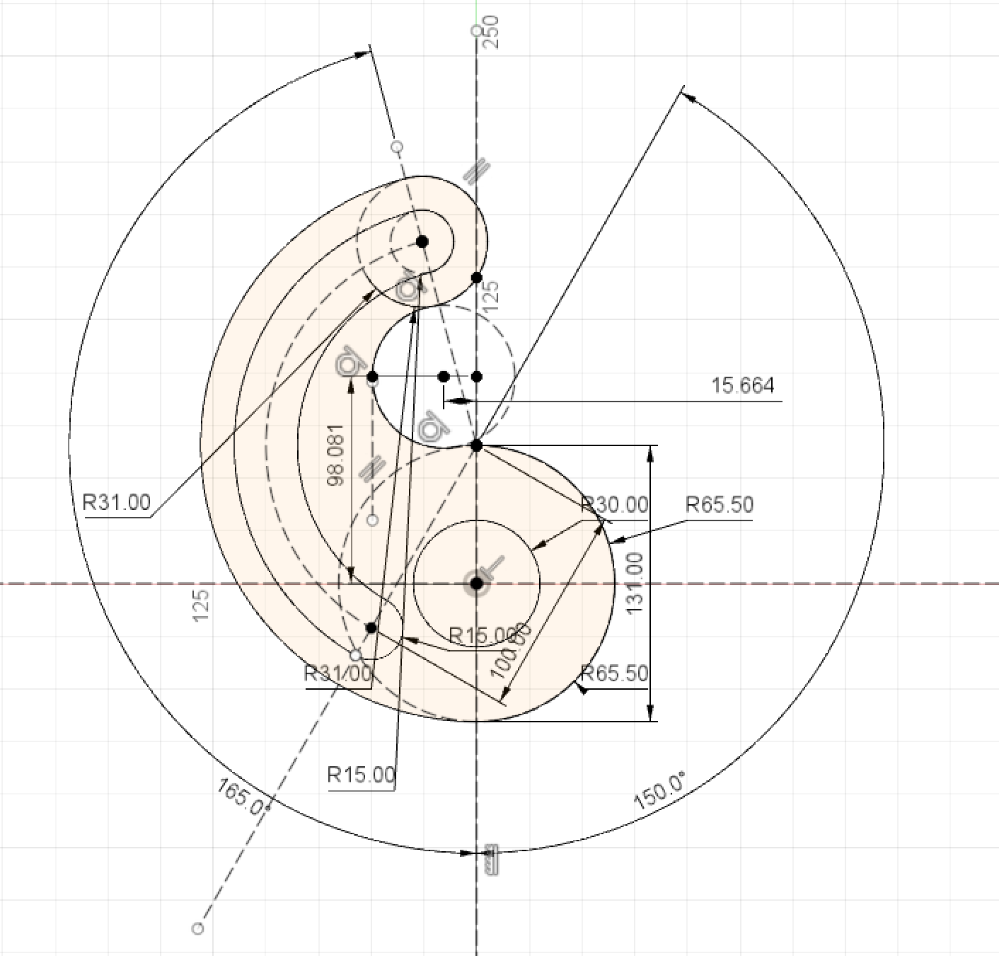

# Sketch using Fusion 360 API

## About Fusion 360
[Fusion 360](https://www.autodesk.com/products/fusion-360/overview#banner) is a program that can do 3D Design & Modeling, simulation, generative Design, documentation, collaboration, manufacturing. The fusion 360 release API for people to create their design. API is powerful for manufacturing to create similar but different size of material because you can just change the size and the script will run the modle out for you. 

## Objective
In this project, we use fusion 360 API to create 2D sketches. We have to make sure everything is fully constrain, and the size of the varable is changeable without breaking the model.

## How to use
Introduction for how to use [Fusion 360 API](http://help.autodesk.com/view/fusion360/ENU/?guid=GUID-A92A4B10-3781-4925-94C6-47DA85A4F65A). Import the scrip in the add in and run it.

## Steps
Here is the steps of draw EX1. First, make the construction line of the bottom outside circle and the x, y line. Base on the x and y line create two angle construction line 15 deg and 30 deg. Then, draw mid and top construction circle that are tangent to each other. At the end, just connect with the cruve base on the construction line.
